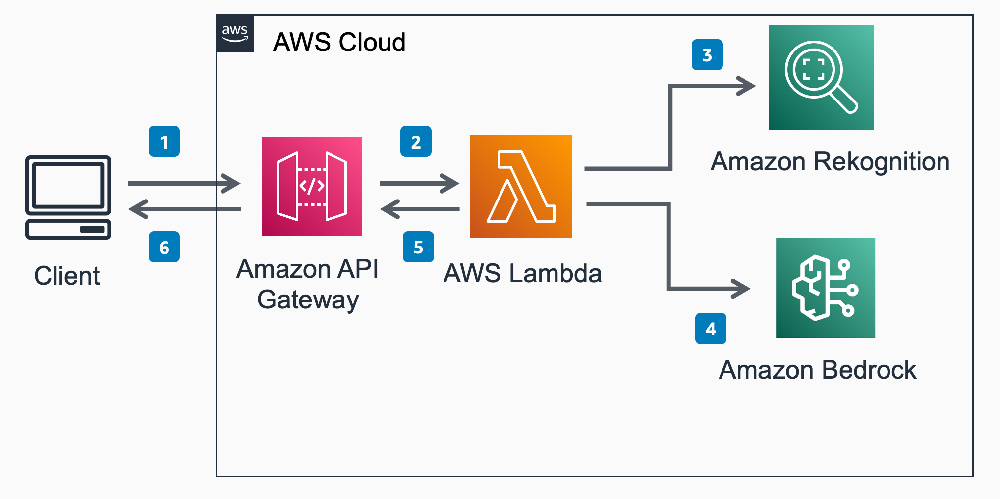

# Generating Product Descriptions with Bedrock

This solution contains a serverless backend and ReactJS front-end application which creates product descriptions from images and text input, enhances and translates product descriptions using the new managed generative AI service, Amazon Bedrock.

## Table of Contents

1. [Overview](#overview)
    - [Cost](#cost)
2. [Prerequisites](#prerequisites)
3. [Deployment Steps](#deployment-steps)
4. [Deployment Validation](#deployment-validation)
5. [Running the Guidance](#running-the-guidance)
6. [Next Steps](#next-steps)
7. [Cleanup](#cleanup)
8. [Additional considerations and limitations](#additional-considerations-and-limitations)


## Overview

Retail businesses often have many thousands or millions of products, all of which require accurate and effective descriptions. Retailers often have existing metadata or images for these products that can be provided as inputs to generative AI models to greatly accelerate the process of creating product descriptions.



1. The client sends a request including input data (either a product image or a basic product description to enhance) to the Amazon API Gateway REST API.
2. Amazon API Gateway passes the request to AWS Lambda through a proxy integration.
3. When operating on product image inputs, AWS Lambda calls Amazon Rekognition, which uses machine learning  to detect objects in the image. Descriptions of the objects detected can then be fed into subsequent steps to create a product description.
4. AWS Lambda calls large language models (LLMs) hosted by Amazon Bedrock, such as the Amazon Titan language models, to produce product descriptions. The LLMs can either enhance existing basic text descriptions, or generate new descriptions based on the objects detected by Amazon Rekognition.
5. AWS Lambda passes the response to Amazon API Gateway.
6. Finally, Amazon API Gateway returns the HTTP response to the client.


### Cost

_You are responsible for the cost of the AWS services used while running this Guidance. As of November 2023, the cost for running this Guidance with the default settings in the US East (N. Virginia) is approximately $86 per month for processing 1000 products each month._

This guidance includes the AWS services Rekognition, Bedrock, Cognito, Lambda, API Gateway and CloudWatch with costs as follow:

- Rekognition: $0.001 per image (for the first million images)
- Bedrock: Depends on the model. Claude Instant for example is $0.00163 per 1000 input tokens and $0.00551 per 1000 output tokens, and the AI21 Jurassic model is $0.0125 per 1000 input/output tokens
- Cognito: Free for up to 50k users ($0.0055 per monthly active user thereafter)
- API Gateway: $3.50 per million requests
- Lambda: $0.0000166667 per GB second or $0.0005 per invocation for this guidance assuming a worst-case 30s duration
- CloudWatch logs: $0.50 per GB collected, $0.03 per month per GB stored

Conservatively (erring on the side of overestimating), using this solution to generate product descriptions based on input images 1000 times per month (including generating translations into Spanish, German, and French), and assuming a worst case of 30s per Lambda function invocation and 1000 input/output tokens for all calls to Claude Instant and Jurassic models, costs would be approximately as follows:

- Rekognition: $0.001 per image * 1000 images = $1.00
- Bedrock: $0.00163 + $0.00551 per call to Claude Instant * 1000 calls = $7.14 and $0.0125 * 2 per call to Jurassic * 1000 calls * 3 languages = $75
- Cognito: Free
- API Gateway: $3.50 per million invocations * 5000 total invocations = $0.0175
- Lambda: $0.0005 per invocation * 5000 total invocations = $2.50
- CloudWatch logs: Conservatively assume 1 GB collected, costing approximately $0.53 for the first month
- TOTAL: $86 per month with 1000 uses per month (or only $11 per month if translations are disabled)


## Prerequisites

You'll need to install all prerequisites on your local machine:
    
1. [Python 3.8 or higher](https://www.python.org/downloads/macos/)
2. [Node.js & npm](https://docs.npmjs.com/downloading-and-installing-node-js-and-npm)
3. Install the AWS CDK Toolkit (the `cdk` command) as documented [here](https://docs.aws.amazon.com/cdk/v2/guide/cli.html). You will also need to run `cdk bootstrap` if you haven't used the CDK before in your account as discussed [here](https://docs.aws.amazon.com/cdk/v2/guide/bootstrapping.html).
4. The [AWS CLI](https://docs.aws.amazon.com/cli/latest/userguide/getting-started-install.html)
5. [Docker](https://www.docker.com/) is required to allow the CDK to package the Lambda code together with the necessary Python dependencies
6. The project should work in any macOS, Linux, or Windows environment with the above prerequisites, but the project has been tested in macOS and Linux. Some commands and utility scripts assume a Bash shell environment.
7. The Claude Instant, Stable Diffusion SDXL0.8, and AI21 Jurassic-2 Mid must be enabled in Bedrock as documented [here](https://docs.aws.amazon.com/bedrock/latest/userguide/model-access.html)

**NOTE:** Docker must be installed and _running_. You can ensure that the Docker daemon is running by ensuring that a command like `docker ps` runs without error. If no containers are running, then `docker ps` should return an empty list of containers like this:

```
CONTAINER ID   IMAGE     COMMAND   CREATED   STATUS    PORTS     NAMES
```

## Deployment Steps

1. Create an [EC2 environment in AWS Cloud9](https://docs.aws.amazon.com/cloud9/latest/user-guide/create-environment-main.html), launch the EC2 instance into a public subnet, and write down its Public IPv4 address (#cloud9_ec2_ip).
  
2. [Resize the EBS volume](https://docs.aws.amazon.com/cloud9/latest/user-guide/move-environment.html#move-environment-resize) that the environment (created in Step 1) uses to at least 20GB. It comes with 10GB by default.
   
3. Clone the repo:
   ```
   git clone https://github.com/aws-solutions-library-samples/guidance-for-generating-product-descriptions-with-bedrock.git
   ```
4. cd to the repo folder:
   ```
   cd guidance-for-generating-product-descriptions-with-bedrock
   ```
5. (Optional) create a new Python virtualenv for project-specific dependencies:
   ```
   python -m venv .env && source .env/bin/activate
   ```
6. Install CDK dependencies:
   ```
   pip install -r deployment/requirements.txt
   ```
7. [Bootstrapping](https://docs.aws.amazon.com/cdk/v2/guide/bootstrapping.html) for AWS CDK, if it has not been done previously:
   ```
   cd deployment && cdk bootstrap
   ```
8. Deploy the backend:
   ```
   cd deployment && cdk deploy
   ```
9. cd back to the project root:
   ```
   cd ..
   ```
10. Create an initial Cognito user:
    ```
    deployment/create-user.sh <<your email address>>
    ```
11. Update `config.js` with the appropriate values from CDK stack outputs. This can be done automatically by running
    ```
    deployment/update-config.sh
    ```
12. Install frontend dependencies:
    ```
    cd source/frontend && npm install
    ```
13. Run the sample client app, and write down the port number (#web_port) that the webpack listens to, ex. 8080.
    ```
    npm start
    ```
14. Open the Security Groups of the EC2 created in Step 1, add an inbound rule, which allows Custom TCP, Port range #web_port, Source “My IP”, then Save rules.


## Deployment Validation

The deployment should be successful if all of the above commands complete without error. You can browse the backend resources created by navigating to the CloudFormation service in the AWS Console, finding the stack named `LambdaStack`, and browsing its resources.

## Running the Guidance

You can try the demo web app by following these steps:
1. Check your email for a temporary password
2. Access the app from a local browser at #cloud9_public_ip:#web_port
3. Follow the prompts to log in and change your password
4. To create a product description from an image (the default mode), browse for an image file for some product or object
5. Once uploaded, a product description and translations into several languages will be generated

## Next Steps

See the Bedrock [product page](https://aws.amazon.com/bedrock/) for more resources on using Amazon Bedrock.


## Cleanup

The provisioned infrastructure can be deleted by running the following command:
```
cd deployment && cdk destroy
```


**Additional considerations and limitations**

- Because this project passes base64-encoded images into Lambda functions through the event payload, the total input size is limited to 6 MB, which limits the size of input images.
- The Lambda and API Gateway proxy integration limits processing time to 29 seconds per call, which could prevent larger product descriptions from being generated. This limitation could be overcome using alternative approaches, such as streaming responses via Lambda function URLs instead of API Gateway.

